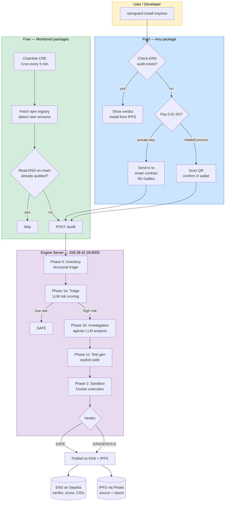
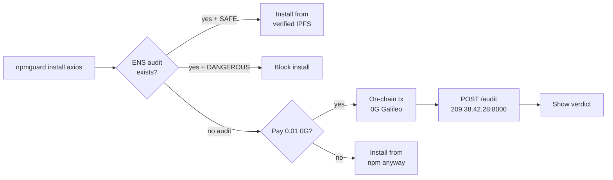

# NpmGuard

Autonomous npm supply chain security auditor. Monitors npm for new package releases, audits them through a multi-step security pipeline, and publishes verifiable results on-chain via ENS (Sepolia) + IPFS.

Users can pay for audits on-chain (0G Galileo Testnet) via the CLI — with a private key or by scanning a WalletConnect QR code from their mobile wallet.

Any developer or AI agent can check `axios.npmguard.eth` before installing a package.

> Built at [ETHGlobal Cannes 2026](https://ethglobal.com/events/cannes)

## How it works



## CLI Flow



## Live Services

| Service | URL |
|---------|-----|
| Frontend Dashboard | [`http://209.38.42.28:3000`](http://209.38.42.28:3000) |
| Audit Engine API | [`http://209.38.42.28:8000`](http://209.38.42.28:8000) |
| CLI (npm) | [`npx npmguard-cli`](https://www.npmjs.com/package/npmguard-cli) |
| 0G Contract | [`0x1201448ae5f00e1783036439569e71ab3757d0de`](https://chainscan-galileo.0g.ai/address/0x1201448ae5f00e1783036439569e71ab3757d0de) |
| ENS Registry | [`npmguard.eth`](https://sepolia.app.ens.domains/npmguard.eth) |

## ENS Registry

```
npmguard.eth
  └── axios.npmguard.eth
        └── 1-14-0.axios.npmguard.eth
              ├── npmguard.verdict      → safe
              ├── npmguard.score        → 92
              ├── npmguard.capabilities → network
              ├── npmguard.report_cid   → bafkrei...
              └── npmguard.source_cid   → bafybei...
```

## Project Structure

| Directory | Description |
|-----------|-------------|
| `frontend/` | React + Vite dashboard — live audit streaming with SSE |
| `engine/` | TypeScript audit pipeline — inventory, static analysis, sandbox |
| `cli/` | `npmguard-cli` — check/install packages with ENS audit + on-chain payment |
| `contracts/` | Solidity smart contract + multi-chain deploy/verify scripts |
| `chainlink/` | CRE workflow — monitors npm, reads ENS on-chain, triggers audits |
| `npmguard/` | ENS/IPFS publisher, demo packages, `sginstall` |
| `sandbox/` | Dynamic exploitation harness (Vitest) |
| `ai-sdk/` | AI SDK-based vulnerability verifier prototype |
| `openclaw/` | OpenClaw-based verifier prototype and Dockerized reasoning runtime |
| `docs/` | Architecture docs, research notes, production guides |

## Quick Start

### CLI

```bash
# Install a package with on-chain audit (pays 0.01 0G via WalletConnect QR)
npx npmguard-cli install express

# Check all dependencies in a project
npx npmguard-cli check --path /your/project
```

### Audit Engine API

The engine is live at `http://209.38.42.28:8000`.

```bash
# Health check
curl http://209.38.42.28:8000/health

# Trigger an audit
curl -X POST http://209.38.42.28:8000/audit \
  -H 'Content-Type: application/json' \
  -d '{"packageName": "express", "version": "5.2.1"}'
```

### Run locally (engine + frontend)

```bash
bash run.sh
# Engine on :8000, Frontend on :3000
```

Or individually:

```bash
cd engine && npm install && npx tsx src/index.ts   # API on :8000
cd frontend && npm install && npm run dev           # UI on :3000
```

### Deploy (DigitalOcean)

See [engine/README.md](engine/README.md#deploy-to-digitalocean) for full instructions.

### Chainlink CRE Workflow

Decentralized npm monitoring via [Chainlink CRE](https://docs.chain.link/cre). Runs on the DON (Decentralized Oracle Network) — no single point of failure. Each trigger fetches npm, reads ENS on-chain (trustless via EVMClient), and triggers the audit engine if the package isn't yet audited.

```bash
cd chainlink/npm-monitor && bun install
```

| Command | What it does |
|---------|-------------|
| `cre workflow simulate npm-monitor -T staging-settings --trigger-index 1 --non-interactive` | **Cron** — checks all monitored packages (axios, lodash, express, chalk, code-formatter) every 5 min |
| `cre workflow simulate npm-monitor -T staging-settings --trigger-index 0 --http-payload '{"package":"axios"}' --non-interactive` | **HTTP trigger** — check a single package on demand |
| `cre login` | Authenticate with CRE CLI (required before simulate) |

### Deploy Contract

```bash
cd contracts && npm install && npm run compile

# Deploy on 0G Galileo (default)
DEPLOY_CHAIN=og npm run deploy

# Deploy on Sepolia or Base Sepolia
DEPLOY_CHAIN=sepolia npm run deploy
DEPLOY_CHAIN=base-sepolia npm run deploy
```

### OpenClaw Verifier

The Dockerized OpenClaw verifier prototype, model-switching commands, and manual fixture commands are documented in [openclaw/README.md](openclaw/README.md).

## Tech Stack

| Component | Technology |
|-----------|------------|
| Frontend | [React](https://react.dev/) + [Vite](https://vite.dev/) + [Tailwind CSS](https://tailwindcss.com/) — real-time SSE audit dashboard |
| Audit Pipeline | TypeScript + [Hono](https://hono.dev/) — inventory, LLM static analysis, Docker sandbox |
| LLM | [Gemini 2.5 Flash](https://ai.google.dev/) via OpenAI-compatible API (switchable to Anthropic) |
| Monitoring | [Chainlink CRE](https://docs.chain.link/cre) — Cron + HTTP + EVMClient |
| Payment | Solidity smart contract on [0G Galileo Testnet](https://chainscan-galileo.0g.ai) + WalletConnect v2 |
| On-chain Registry | [ENS](https://docs.ens.domains/) subnames on Sepolia |
| Storage | [IPFS](https://pinata.cloud/) via Pinata |
| CLI | TypeScript, published as [`npmguard-cli`](https://www.npmjs.com/package/npmguard-cli) on npm |
| Hosting | [DigitalOcean](https://www.digitalocean.com/) Droplet (Docker + Node.js) |

## Team

Built at ETHGlobal Cannes 2026.
