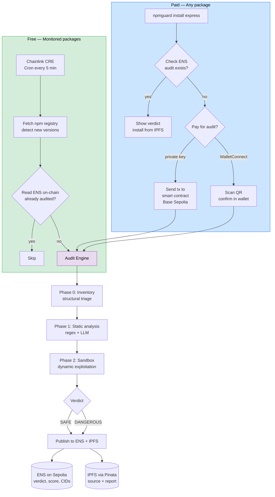
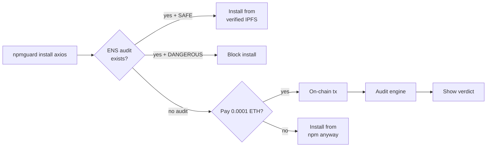

# NpmGuard

Autonomous npm supply chain security auditor. Monitors npm for new package releases, audits them through a multi-step security pipeline, and publishes verifiable results on-chain via ENS (Sepolia) + IPFS.

Users can pay for audits on-chain (Base Sepolia) via the CLI — with a private key or by scanning a WalletConnect QR code from their mobile wallet.

Any developer or AI agent can check `axios.npmguard.eth` before installing a package.

> Built at [ETHGlobal Cannes 2026](https://ethglobal.com/events/cannes)

## How it works



## CLI Flow



## ENS Registry

```
npmguard.eth
  └── axios.npmguard.eth
        └── 1-14-0.axios.npmguard.eth
              ├── npmguard.verdict      → safe
              ├── npmguard.score        → 92
              ├── npmguard.capabilities → network
              ├── npmguard.report_cid   → bafkrei...
              └── npmguard.source_cid   → bafybei...
```

## Smart Contracts

| Contract | Network | Address |
|----------|---------|---------|
| NpmGuardAuditRequest | Base Sepolia | [`0x071e...63b8`](https://sepolia.basescan.org/address/0x071e893552f89876bdc1f514fbf882fd167163b8) |
| NpmGuardAuditRequest | Sepolia | [`0x4bba...d6ae`](https://sepolia.etherscan.io/address/0x4bbaf196bde9e02594631e03c28ebe16719214f3) |
| ENS Public Resolver | Sepolia | `0xE996...49b5` |

## Project Structure

| Directory | Description |
|-----------|-------------|
| `chainlink/` | CRE workflow — monitors npm, reads ENS on-chain, triggers audits |
| `engine/` | TypeScript audit pipeline — inventory, static analysis, sandbox |
| `ai-sdk/` | AI SDK–based vulnerability verifier prototype |
| `openclaw/` | OpenClaw-based verifier prototype and Dockerized reasoning runtime |
| `cli/` | `npmguard-cli` — check/install packages with ENS audit + on-chain payment |
| `contracts/` | Solidity smart contract + deploy/verify scripts |
| `sandbox/` | Dynamic exploitation harness (Vitest) |
| `npmguard/` | ENS/IPFS demo publisher, demo packages, `sginstall` |
| `docs/` | Architecture docs, research notes, production guides |
| `artifacts/` | Cached tarballs, reports, npm-cache |
| `test-package-install/` | Minimal workspace for testing package installation |

## Quick Start

### CLI

```bash
# Check all dependencies in a project
npx npmguard-cli check --path /your/project

# Install with audit check (reads ENS)
npx npmguard-cli install axios

# Install with paid audit (triggers engine if not yet audited)
NPMGUARD_PRIVATE_KEY=0x... npx npmguard-cli install some-new-package
```

### Chainlink CRE Workflow

```bash
cd chainlink/npm-monitor && bun install
cre workflow simulate npm-monitor -T staging-settings --trigger-index 0 \
  --http-payload '{"package":"axios"}' --non-interactive
```

### Audit Engine

```bash
cd engine && npm install && npx tsx src/index.ts
```

### Deploy Contract

```bash
cd contracts && npm install && npm run compile && npm run deploy
```


### OpenClaw Verifier

The Dockerized OpenClaw verifier prototype, model-switching commands, and manual fixture commands are documented in [openclaw/README.md](/Users/piotrtyrakowski/repos/EthCannes2026/openclaw/README.md).

## Tech Stack

| Component | Technology |
|-----------|------------|
| Monitoring | [Chainlink CRE](https://docs.chain.link/cre) — Cron + HTTP + EVMClient |
| Audit Pipeline | TypeScript + [Hono](https://hono.dev/) — inventory, LLM static analysis, Docker sandbox |
| Payment | Solidity smart contract on Base Sepolia + WalletConnect v2 |
| On-chain Registry | [ENS](https://docs.ens.domains/) subnames on Sepolia |
| Storage | [IPFS](https://pinata.cloud/) via Pinata |
| CLI | TypeScript, published as [`npmguard-cli`](https://www.npmjs.com/package/npmguard-cli) on npm |

## Team

Built at ETHGlobal Cannes 2026.
