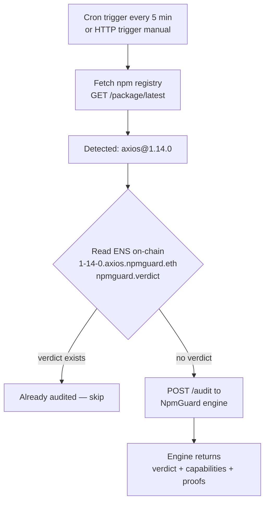
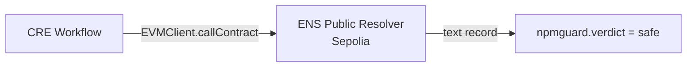

# Chainlink CRE — npm Monitor Workflow

CRE workflow that monitors npm packages for new versions, checks ENS on-chain for existing audits, and triggers the NpmGuard audit engine when needed.

## How it works



What happens step by step:

1. **Trigger** — Cron fires every 5 min (production) or HTTP trigger fires on demand (demo)
2. **Fetch npm** — For each monitored package, fetches `registry.npmjs.org/{package}/latest` to get the current version
3. **Check ENS on-chain** — Reads `npmguard.verdict` text record on `{version}.{package}.npmguard.eth` via EVMClient chain read on Sepolia. This is a direct on-chain read, no API intermediary.
4. **Skip or audit** — If a verdict exists, the version was already audited → skip. If no verdict, trigger the audit engine via HTTP POST.
5. **Audit result** — The engine returns verdict (SAFE/DANGEROUS), capabilities, and proofs.

## Triggers

| Trigger | Use case | Input |
|---------|----------|-------|
| **HTTP** | Demo — check single package on demand | `{"package": "axios"}` |
| **Cron** | Production — check all packages every 5 min | Reads from config |

## Config

`npm-monitor/config.staging.json`:

```json
{
  "packages": ["code-formatter", "axios", "lodash", "express", "chalk"],
  "auditApiUrl": "http://209.38.42.28:8000/audit",
  "schedule": "0 */5 * * * *"
}
```

## Prerequisites

- [Bun](https://bun.sh) >= 1.2.21
- [CRE CLI](https://docs.chain.link/cre/getting-started/cli-installation) v1.9+
- `cre login` authenticated

## Setup

```bash
cd npm-monitor && bun install
```

## Simulate

HTTP trigger (single package):

```bash
cre workflow simulate npm-monitor -T staging-settings --trigger-index 0 --http-payload '{"package":"axios"}' --non-interactive
```

Cron trigger (all packages — needs custom limits):

```bash
cre workflow simulate npm-monitor -T staging-settings --trigger-index 1 --non-interactive --limits /path/to/npm-monitor/limits.json
```

## Audit Engine

The audit engine is live at `http://209.38.42.28:8000`. The `config.staging.json` already points to it.

> See [engine/README.md](../engine/README.md) for deployment details.

## On-chain ENS read

The workflow reads ENS text records directly on Sepolia using the CRE EVMClient. It calls `text(node, "npmguard.verdict")` on the ENS Public Resolver contract (`0xE99638b40E4Fff0129D56f03b55b6bbC4BBE49b5`).



Note: ENS reads use `LAST_FINALIZED_BLOCK_NUMBER`, so newly published records need ~15 min for Sepolia finality before the workflow can read them.

## Project structure

```
chainlink/
├── project.yaml              # RPC endpoints (Sepolia)
├── secrets.yaml              # Secret mappings
├── commands.md               # Quick reference commands
└── npm-monitor/
    ├── main.ts               # Entry point — registers HTTP + Cron triggers
    ├── workflow.ts            # Handlers — npm fetch, ENS check, audit trigger
    ├── config.staging.json   # Packages list, audit API URL, cron schedule
    ├── limits.json           # Custom simulation limits (20 HTTP calls)
    ├── workflow.yaml         # CRE workflow settings
    ├── package.json          # Dependencies (@chainlink/cre-sdk)
    └── tsconfig.json
```
