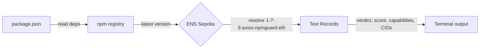
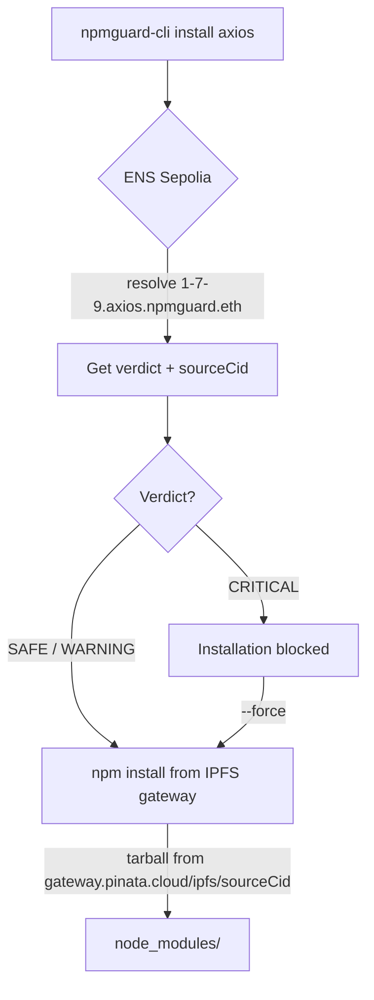
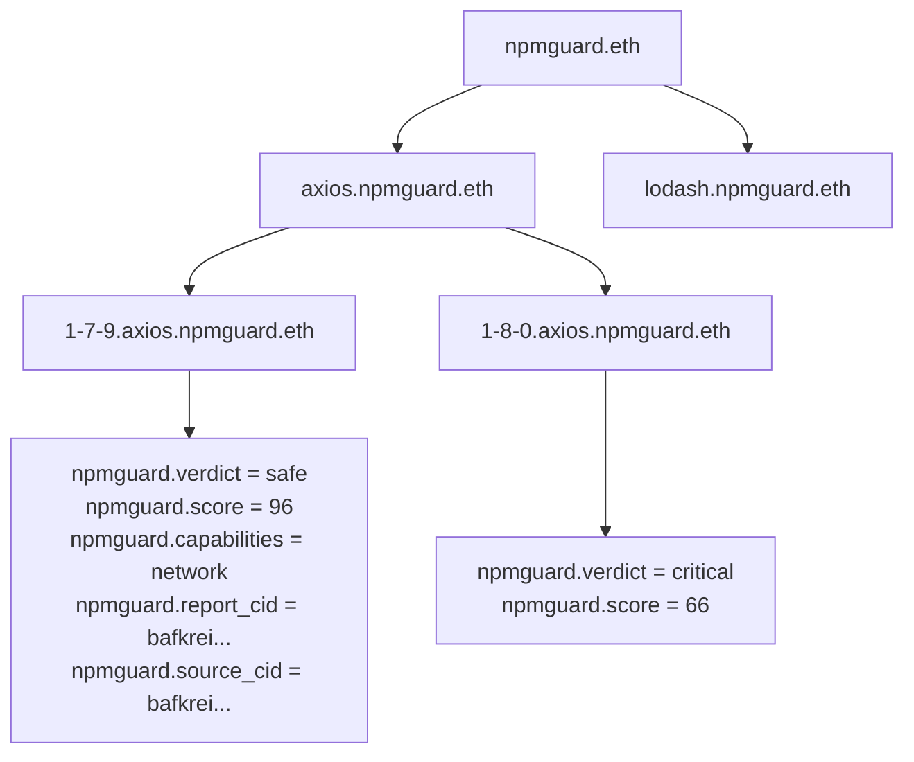

# npmguard-cli

CLI that checks npm packages against on-chain audit records before installing. Published on npm as [`npmguard-cli`](https://www.npmjs.com/package/npmguard-cli).

## `npmguard-cli check`

Scans your `package.json`, queries the npm registry for available updates, then resolves each package version against ENS on Sepolia to find audit records.

```bash
npx npmguard-cli check --path /your/project
```



What happens:

1. Reads `package.json` and extracts all dependencies
2. For each dependency, fetches `https://registry.npmjs.org/{package}/latest` to get the latest version
3. Constructs the ENS name: `{version}.{package}.npmguard.eth` (e.g. `1-7-9.axios.npmguard.eth`)
4. Resolves these ENS text records on Sepolia via a public RPC:
   - `npmguard.verdict` — SAFE / CRITICAL
   - `npmguard.score` — 0 to 100
   - `npmguard.capabilities` — network, filesystem, process_spawn, etc.
   - `npmguard.report_cid` — IPFS CID of the full audit report
   - `npmguard.source_cid` — IPFS CID of the audited source code
5. Displays a table with verdict and capabilities per package
6. Lists clickable IPFS links to the full audit reports

Example output:

```
NpmGuard Dependency Audit

┌─────────┬───────────┬────────┬──────────────┬──────────────┐
│ Package │ Installed │ Latest │ Verdict      │ Capabilities │
├─────────┼───────────┼────────┼──────────────┼──────────────┤
│ axios   │ 1.6.0     │ 1.7.9  │ SAFE (96)    │ network      │
├─────────┼───────────┼────────┼──────────────┼──────────────┤
│ lodash  │ 4.17.21   │ 4.18.1 │ CRITICAL (12)│ network, ... │
├─────────┼───────────┼────────┼──────────────┼──────────────┤
│ chalk   │ 5.6.2     │ 5.6.2  │ NOT AUDITED  │ -            │
└─────────┴───────────┴────────┴──────────────┴──────────────┘

  1 safe | 1 critical | 1 not audited

  axios@1.7.9 report: https://gateway.pinata.cloud/ipfs/bafkrei...
  lodash@4.18.1 report: https://gateway.pinata.cloud/ipfs/bafkrei...
```

## `npmguard-cli install`

Installs a package from IPFS instead of the npm registry when an audit record exists on ENS.

```bash
npx npmguard-cli install axios
npx npmguard-cli install axios@1.7.9
```



What happens:

1. If no version specified, fetches the latest version from npm registry
2. Resolves `{version}.{package}.npmguard.eth` on Sepolia ENS
3. Reads the `npmguard.source_cid` text record — the IPFS CID of the audited source tarball
4. Runs `npm install https://gateway.pinata.cloud/ipfs/{sourceCid}`
5. npm downloads the tarball directly from IPFS and installs it

The result in `package-lock.json`:

```json
"node_modules/axios": {
  "version": "1.7.9",
  "resolved": "https://gateway.pinata.cloud/ipfs/bafkrei...",
  "integrity": "sha512-..."
}
```

The `resolved` field points to IPFS, not npm. Anyone running `npm install` on this project gets the exact same IPFS-verified code.

If the package is flagged **CRITICAL**, installation is blocked:

```
  lodash@4.18.1

  CRITICAL (score: 12)
  Capabilities: network, filesystem, process_spawn
  Report: https://gateway.pinata.cloud/ipfs/bafkrei...

  Installation blocked. This package has critical security issues.
  Use --force to install anyway.
```

If no audit record exists on ENS, falls back to standard `npm install`.

## ENS structure



## Project structure

```
cli/
├── src/
│   ├── index.ts              # Entry point — commander setup
│   ├── audit-source.ts       # AuditSource interface
│   ├── ens-source.ts         # Reads ENS text records on Sepolia via viem
│   ├── mock-source.ts        # Mock data for testing without ENS
│   ├── scanner.ts            # Reads package.json + fetches npm for updates
│   └── commands/
│       ├── check.ts          # npmguard-cli check
│       └── install.ts        # npmguard-cli install
├── reports/                  # Sample audit reports (uploaded to IPFS)
├── package.json
└── tsconfig.json
```

## Development

```bash
cd cli && npm install

# Run locally
npx tsx src/index.ts check --path /tmp/test-project
npx tsx src/index.ts install axios@1.7.9

# Build
npm run build

# Publish
npm publish
```
